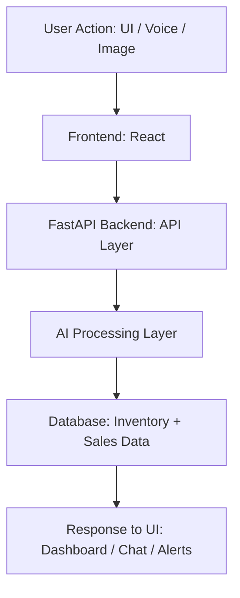

# 🚀 InvenPro – Smart Stock Keeper
https://invenpro-ui.onrender.com


InvenPro is a state-of-the-art smart inventory management system designed to help businesses and individuals efficiently track, manage, and analyze stock in real time. By leveraging advanced AI technologies, InvenPro transforms traditional inventory tracking into a predictive and automated experience.

---

## ✨ Features

*   📦 **Real-time Inventory Tracking**: Monitor stock levels across multiple locations instantly.
*   📊 **Smart Stock Monitoring**: Automated updates and low-stock alerts.
*   ⚡ **Fast & Responsive UI**: Built with modern React and TypeScript for a smooth experience.
*   🔗 **Seamless Backend Integration**: Powered by a high-performance FastAPI server.
*   🛡️ **Secure Data Management**: Robust handling of inventory records and user data.

---

## 🤖 AI & Smart Capabilities

InvenPro integrates cutting-edge AI to provide more than just tracking. Here’s how we use advanced technologies:

*   **👁️ Computer Vision (CV)**: 
    *   **Live Barcode Scanning**: Uses the camera to scan and identify products instantly.
    *   **Visual Product Recognition**: Detects items and updates stock counts through image analysis.
*   **🗣️ Natural Language Processing (NLP) & LLM**:
    *   **Conversational Intelligence**: Powered by OpenAI and LangChain to understand complex user intent and context.
    *   **InvenBot Assistant**: A GPT-powered chatbot that can "reason" over your stock data to answer questions like *"Which supplier should I order from for the best price on monitors?"*
    *   **Automated Action Extraction**: Automatically converts natural speech/text into database commands (e.g., "Add 50 units of XYZ") without manual form filling.
*   **📈 Machine Learning (ML) & Prediction Models**:
    *   **Demand Forecasting**: Predicts future sales trends based on historical data.
    *   **Stockout Prevention**: AI models forecast when an item will go out of stock and suggest reorder dates.
*   **🎯 Recommendation System**:
    *   **Smart Reordering**: Suggests optimal restock quantities to minimize storage costs while maximizing availability.
    *   **Trend Identification**: Recommends items that are trending or identifies slow-moving stock for clearance.

---

## 🧠 How the AI System Works (Implementation Overview)

InvenPro’s AI capabilities are built as modular services integrated into the FastAPI backend. Each component is designed to process specific types of input and enhance inventory intelligence.

### 🔄 End-to-End Data Flow



### 🔍 NLP Query Processing Pipeline

**Step-by-step:**
1.  **Input**: User enters query (text/voice).
2.  **Processing**: Text is processed using NLP models (Transformers/LangChain).
3.  **Extraction**: Intent + entities are extracted (e.g., "Show me low stock electronics").
4.  **Mapping**: Backend maps intent → specific API logic.
5.  **Result**: Database queried → filtered response returned to UI.

### 📷 Computer Vision Pipeline

**Step-by-step:**
1.  **Capture**: User scans barcode or uploads a product image.
2.  **Detection**: Image processed using OpenCV and ZXing libraries.
3.  **Identification**: Barcode or object detected and matched against the Product Database.
4.  **Update**: System automatically updates or retrieves item information.

### 📈 ML Prediction Pipeline

**Training Phase:**
`Historical Sales Data` → `Data Preprocessing (Pandas)` → `Model Training (Scikit-Learn)` → `Saved Model (.pkl)`

**Prediction Phase:**
`New Input Data` → `Load Trained Model` → `Predict Future Demand` → `Return Forecast to Dashboard`

### 💬 AI Chatbot (InvenBot) Workflow

**How it works:**
1.  **Message**: User sends a conversational message (e.g., "Add 20 units of Milk").
2.  **Analysis**: Message sent to LLM (OpenAI/Local LLM) via LangChain.
3.  **Action**: LLM extracts structured data `{ "item": "milk", "quantity": 20 }`.
4.  **Execution**: Backend executes the corresponding update function.
5.  **Feedback**: Response returned conversationally: "Got it! Added 20 units of milk to the inventory."

### 🎯 Recommendation Engine Logic

*   **Rule-Based**: If `stock < threshold`, trigger "Recommend Reorder".
*   **ML-Based**: Demand-based ranking and sales pattern clustering to optimize inventory levels and suggest seasonal stock adjustments.

### 📊 Database Design (Conceptual)
*   **Products Table**: Core item details and metadata.
*   **Inventory Table**: Real-time stock levels and location data.
*   **Sales Table**: Historical transaction data for ML training.
*   **Predictions Table**: Stored forecast results for dashboard visualization.

### ⚙️ Key API Endpoints
| Endpoint | Description |
| :--- | :--- |
| `/chat` | AI chatbot interaction and conversational queries |
| `/nlp-query` | Natural language processing for advanced searching |
| `/scan-item` | Computer Vision-based barcode and image detection |
| `/predict` | ML-based future demand predictions |
| `/recommend` | Smart restocking and trend suggestions |

---

## ⚡ Real-World Impact

InvenPro is designed to transform inventory management by delivering tangible benefits:

*   **📉 Reduce Errors**: Minimizes manual entry mistakes through AI-driven automation and CV scanning.
*   **⏰ Save Time**: Automates repetitive tasks like stock counting and reporting.
*   **📊 Data-Driven Decisions**: Provides actionable insights through advanced ML forecasting.
*   **🚀 Scalable Growth**: Designed to support everything from local small businesses to large-scale enterprise systems.

---

## 🛠️ Tech Stack

**Frontend**
*   **React / Vite**: Modern UI framework.
*   **TypeScript**: Type-safe development.
*   **Tailwind CSS**: Premium, responsive styling.
*   **ZXing**: For Computer Vision-based barcode scanning.

**Backend**
*   **FastAPI**: High-performance Python framework.
*   **Uvicorn**: ASGI server for lightning-fast responses.
*   **Scikit-Learn / TensorFlow**: Powering our ML and Prediction models.
*   **OpenAI / LangChain**: Driving the NLP-based Chatbot and AI Assistant.

---

## 📂 Project Structure

```
InvenPro
├── backend     # FastAPI Server, AI Models, & Business Logic
├── frontend    # React Application & Interactive UI
```

---

## ⚙️ Setup Instructions

### 🔹 Backend Setup

```bash
# Open terminal 1
cd backend

# Activate virtual environment
.\venv\Scripts\activate

# Install dependencies
pip install -r requirements.txt

# Run the server
uvicorn main:app --reload
```

---

### 🔹 Frontend Setup

```bash
# Open terminal 2
cd frontend

# Install dependencies
npm install

# Run the application
npm run dev
```

---

## 🌐 Running the Project

*   **Backend runs on**: `http://127.0.0.1:8000`
*   **Frontend runs on**: `http://localhost:5173`

---

## 📸 Screenshots


---

## 🚀 Future Roadmap

*   ☁️ **Cloud Deployment**: Scalable hosting on AWS/GCP.
*   🔔 **Automated Push Notifications**: Real-time alerts on mobile devices.
*   📱 **Dedicated Mobile App**: Using React Native for on-the-go management.
*   🔗 **ERP Integration**: Connecting with larger enterprise systems.

---

## 🤝 Contribution

Contributions are welcome! Feel free to fork the repo and submit a pull request.

